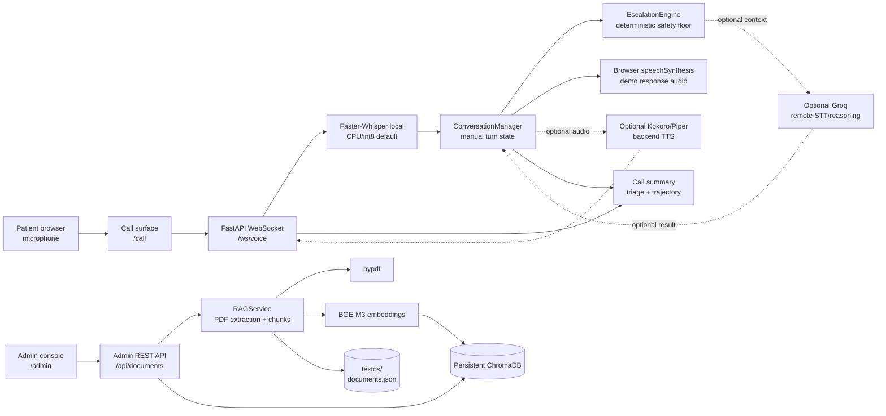
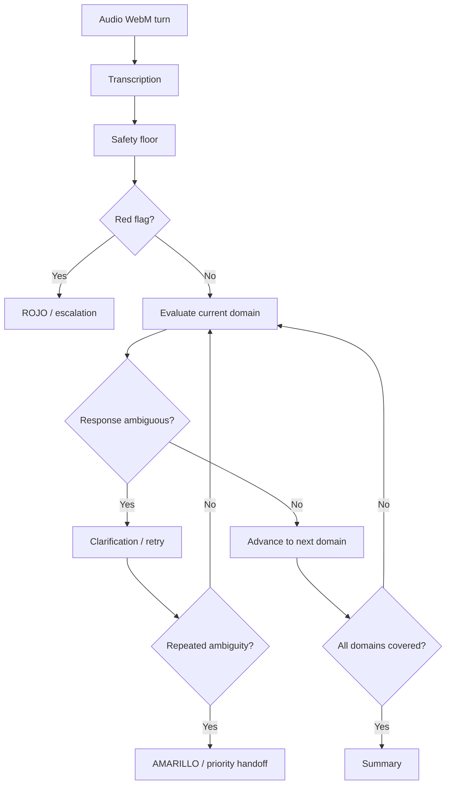

# Architecture Diagram

Postop Voice Agent is a single FastAPI service with a browser call surface, a local document-management surface, and shared conversation, safety, retrieval, and voice services. Solid arrows show implemented paths. Dashed arrows show optional integrations or configuration-dependent paths.

## System Components

## Clinical Decision Flow

This is the implemented decision order for each submitted turn. `EOT` is the explicit browser turn boundary; the backend does not transcribe a size-based prefix.

## Evidence and Optional Integrations

| Area | Implemented in the repository | Optional or configuration-dependent |
|---|---|---|
| Audio input | Browser `MediaRecorder` emits `audio/webm`; manual **Grabar** -> **Enviar** sends `EOT` | Automatic segmentation and telephony are not included |
| Transcription | Local Faster-Whisper with CPU/int8 configuration | Groq Whisper requires explicit configuration, credentials, and network access |
| Safety | `EscalationEngine` evaluates red flags before ambiguity and domain progression | Optional Groq reasoning cannot lower a red-flag escalation |
| Response audio | Browser `speechSynthesis` is the demonstrated path | Kokoro/Piper backend TTS is an optional server path |
| Retrieval | PDF text extraction, chunking, BGE-M3 embeddings, and persistent ChromaDB are wired through the admin API | Retrieval is not a replacement for clinical validation or source governance |

## Event Contracts

| Direction | Event or payload | Meaning |
|---|---|---|
| Browser -> server | Binary `audio/webm` chunks | Audio accumulated for the current turn |
| Browser -> server | Text `EOT` | Submit the complete buffered turn |
| Browser -> server | Text `ping` | Connection liveness check |
| Server -> browser | Binary audio | Initial greeting or optional backend TTS audio |
| Server -> browser | `transcript` with `text` | STT result for the submitted turn |
| Server -> browser | `agent_response` with `text`, `triage_level`, `needs_clarification`, `escalated` | Structured clinical conversation result |
| Server -> browser | `call_summary` with `summary` | Final session summary when a session completes |
| Server -> browser | `error` with `message` | Input or processing failure |
| Server -> browser | Text `pong` | Response to `ping` |

## Design Decisions and Limits

- The deterministic safety floor is evaluated first and cannot be downgraded by optional reasoning.
- A turn is submitted explicitly with `EOT`; this avoids brittle automatic segmentation and makes the browser flow inspectable.
- The default voice route uses a sample trajectory snapshot. It is not authenticated patient data.
- PDF extraction fails closed when `pypdf` is unavailable or a PDF has no extractable text layer.
- The voice session and local RAG store run in the same application process.
- This is a browser microphone/WebSocket workflow, not a telephony integration.
- Process-local rate limiting is not shared protection across multiple workers.

## Legend

- **Solid arrow**: implemented repository path.
- **Dashed arrow**: optional or configuration-dependent integration.
- **Rounded rectangle**: application component or external interface.
- **Cylinder**: persistent local storage.
- `rojo`: red-flag escalation; `amarillo`: priority handoff after repeated ambiguity.

Related setup and operational details are in [README.md](README.md), and the review-oriented evidence is in [Informe_Final.md](Informe_Final.md).
