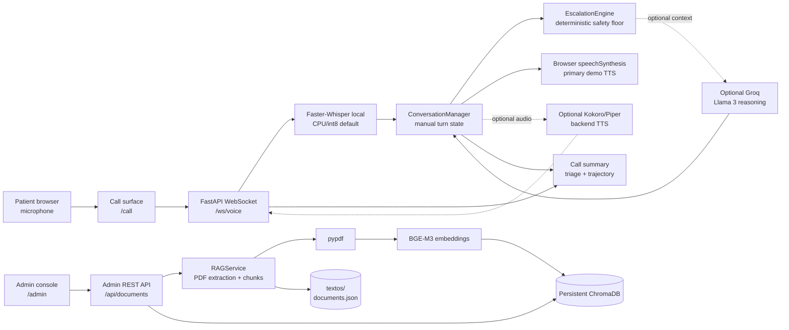

# Architecture Diagram

The application is a single FastAPI service with a browser call surface, a local document-management surface, and shared conversation, safety, retrieval, and voice services.

## Flow

1. `/call` requests microphone access and opens `/ws/voice`.
2. The user performs a manual turn: **Grabar** -> speak -> **Enviar**. The browser sends WebM chunks and `EOT`.
3. `STTService` transcribes with local Faster-Whisper by default. Groq STT is an explicit optional alternative.
4. `ConversationManager` advances through the follow-up domains. `EscalationEngine` evaluates red flags first and cannot be overridden downward by optional Groq reasoning.
5. The browser receives structured events and speaks the response with `speechSynthesis`. Kokoro/Piper are optional backend TTS paths, not the primary demo path.
6. The session can emit a call summary containing triage and trajectory data.
7. Administrators upload PDFs through `/api/documents`; `pypdf` extracts text, the RAG service chunks and embeds it, and ChromaDB persists the collection.

## Boundaries

- This is a browser microphone/WebSocket call, not telephony.
- Turn submission is manual; automatic barge-in is not part of the demonstrated flow.
- The voice session and local RAG store run in the same application process.
- The default voice route uses a sample trajectory snapshot.
- `.env.example` describes configuration without secrets; [LICENSE](LICENSE) defines distribution terms.
