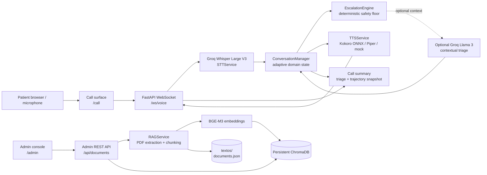

# Architecture Diagram

The system is a single FastAPI service serving a browser call surface, an administrative console, and the backend services that process voice turns and clinical knowledge documents.

## Flow Explanation

1. The browser sends audio chunks through `/ws/voice`. The router buffers audio, supports an end-of-turn control message, applies connection rate limiting, and enforces an idle timeout.
2. `STTService` transcribes the audio with Groq Whisper when configured, or returns a development transcript when a live key is unavailable.
3. `ConversationManager` records the turn and advances through the six follow-up domains. `EscalationEngine` evaluates red flags first. A detected critical signal forces `rojo`; valid but ambiguous input enters the clarification loop.
4. The response text is synthesized by Kokoro when model files are available, otherwise Piper or a mock WAV fallback is used. The WebSocket returns transcript, response metadata, audio, and a final call summary when applicable.
5. Administrators upload PDFs through `/api/documents`. The service validates filenames and MIME/extension expectations, extracts text, creates BGE-M3 embeddings, stores chunks in ChromaDB, and maintains the document registry in `textos/documents.json`.

## Boundaries

- The voice session and local RAG store run inside the same application process.
- The deterministic safety floor is the mandatory safety boundary; optional LLM reasoning is not allowed to downgrade a floor escalation.
- `LICENSE` defines distribution terms, and `.env.example` defines the expected local configuration shape without containing secrets.
